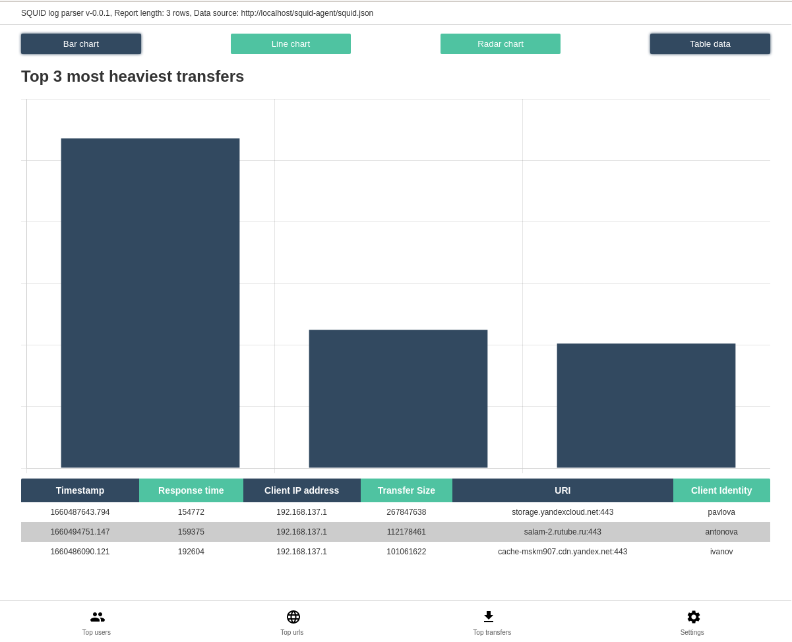

**SQUID parser WEB UI**

This is a simple SQUID proxy server logs parser with friendly WEB UI

**USAGE**

Just clone this repo and run docker-compose up comand

```
docker-compose up -d
```

**Proxy settings**

By defaults there is some demo users in ***./proxy/start_proxy.sh*** file

```
htpasswd -b -c /etc/squid/passwords ivanov ivanov
htpasswd -b /etc/squid/passwords petrov petrov
htpasswd -b /etc/squid/passwords sidorov sidorov
htpasswd -b /etc/squid/passwords egorov egorov
htpasswd -b /etc/squid/passwords antonova antonova
htpasswd -b /etc/squid/passwords pavlova pavlova
htpasswd -b /etc/squid/passwords sokolova sokolova
```

You can manage this shell script or setup any other squid integration to get proxy users list.

**Usage tips**

After runnin docker-compose comand you can find 3 up and running containers

```
IMAGE                  PORTS                                       NAMES
nginx:1.23.1-alpine    0.0.0.0:80->80/tcp, :::80->80/tcp           squid-parser-frontend
python:3.9.13-alpine                                               squid-parser-backend
squid-parser_proxy     0.0.0.0:8000->8000/tcp, :::8000->8000/tcp   squid-parser-proxy
```

as you can see proxy is available at port 8000 and WEB UI at HTTP 80

**And some screenshots in the end**





